# EnterpriseMonitor 详细需求说明书

> **AI 驱动的企业全域智能经营仪表盘**  
> 版本：v1.1 | 日期：2026-04-10 | 作者：Claude Opus 4.6  
> 对标产品：WorldMonitor（worldmonitor.app）  
> 承载平台：品高聆客（LinkPC）  

---

## 目录

1. [产品哲学：为什么需要 EnterpriseMonitor](#1-产品哲学为什么需要-enterprisemonitor)
2. [核心概念模型](#2-核心概念模型)
3. [维度一：内外部信息打通——企业的「边界消融」](#3-维度一内外部信息打通企业的边界消融)
4. [维度二：信息实时性——从「月报文化」到「心跳监测」](#4-维度二信息实时性从月报文化到心跳监测)
5. [维度三：信息密度与丰富度——每个像素都承载决策价值](#5-维度三信息密度与丰富度每个像素都承载决策价值)
6. [维度四：AI 参与度——从「数据搬运工」到「经营参谋部」](#6-维度四ai-参��度从数据搬运工到经营参谋部)
7. [整体界面架构与交互设计](#7-整体界面架构与交互设计)
8. [核心面板详述](#8-核心面板详述)
9. [数据源体系与接入架构](#9-数据源体系与接入架构)
10. [权限、安全与合规](#10-权限安全与合规)
11. [技术架构](#11-技术架构)
12. [实施路径与里程碑](#12-实施路径与里程碑)
13. [附录：WorldMonitor 功能完整映射表](#13-附录worldmonitor-功能完整映射表)

---

## 1. 产品哲学：为什么需要 EnterpriseMonitor

### 1.1 传统运营看板的三重困境

**困境一：信息孤岛**。品高聆客当前集成了 27 个应用——CRM、合同、协作、HR、财务、项目协管——但它们是「并列的抽屉」，不是「融合的画面」。CEO 想知道"这个季度能不能完成目标"，需要打开 CRM 看商机、打开合同系统看签约、���开财务看回款、打开项目协管看交付，然后在脑子里做关联分析。这不是数字化，这是手工作坊。

**困境二：时间滞后**。传统看板的数据按月、按季度刷新。但商业世界是连续的：一条政策今天发布，明天就影响客户预算；一个竞争对手今天降价，下周你的商机就可能丢失。等到月报出来，战机已过。

**困境三：只有数据，没有判断**。传统看板告诉你"本月收入 2,400 万"，但不告诉你"这个数字意味着什么"、"按当前趋势季度能否达标"、"哪些客户的回款在恶化"、"外部哪些变化正在影响你"。数据不等于信息，信息不等于洞察，洞察不等于决策依据。

### 1.2 EnterpriseMonitor 的核心命题

WorldMonitor 做了一件事：把全球地缘政治、军事冲突、金融市场、基础设施风险**融合到一块屏幕上**，让分析师不用在 20 个网站之间跳转，就能「看见世界正在发生什么」。

EnterpriseMonitor 要做同样的事，但面向企业内部：**把分散在 27 个系统里的经营数据，加上企业围墙外的政策、市场、行业、竞争信息，融合到一块屏幕上**，让管理者「看见企业正在发生什么」。

核心公式：

```
EnterpriseMonitor = 品高聆客27个应用的数据融合 
                  + 企业外部经营环境的实时感知 
                  + AI 的持续分析与主动推送
```

### 1.3 关键类比：从 WorldMonitor 到 EnterpriseMonitor

这不是简单的"换皮"。WorldMonitor 的每一个设计决策背后都有情报分析方法论，我们要提取的是**方法论**，而非表面形式：

| WorldMonitor 方法论 | EnterpriseMonitor 应用 |
|-------------------|----------------------|
| **多源情报融合**：435 个数据源汇入一个界面 | **多系统数据融合**：27 个内部系统 + N 个外部源汇入一个看板 |
| **态势感知**：不是看单个事件，而是看整体格局的变化趋势 | **经营态势感知**：不是看单个指标，而是看企业整体健康度的变化趋势 |
| **信号而非噪声**：12 种信号类型从海量数据中提炼关键变化 | **经营信号检测**：从日常运营数据中提炼值得关注的异常与机会 |
| **级联分析**：一个海底电缆断裂会影响哪些国家 | **依赖链分析**：一个客户出问题会影响多少收入、哪些项目、哪些员工 |
| **CII 综合评分**：将多维度指标压缩为一个可比较的数字 | **EHI 综合评分**：将客户/项目/部门的多维健康度压缩为可比较、可排序的评分 |
| **DEFCON 全局警报**：一眼看出全球紧张程度 | **企业风险等级**：一眼看出企业当前经营压力 |
| **地理叠加**：所有信息都锚定在地图上 | **业务地图**：客户、项目、人员、风险都锚定在地理位置上 |

---

## 2. 核心概念模型

### 2.1 三层信息架构

EnterpriseMonitor 的信息不是平铺的，而是分三层，从外到内：

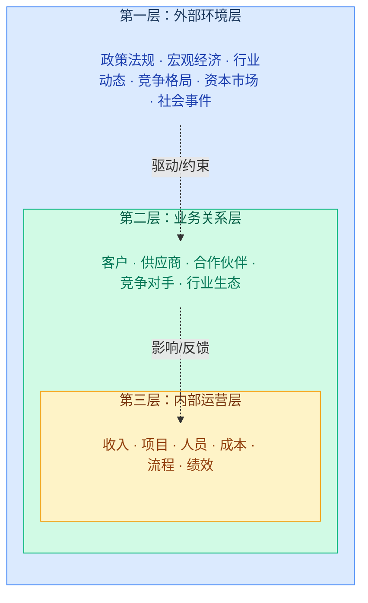

**传统看板只有第三层。EnterpriseMonitor 三层全覆盖，且层与层之间有 AI 驱动的因果关联。**

> **设计原则（v1.1 更新）**：外部信息不设单独入口，而是**融入每个业务维度**。经营页看到资本市场和竞对，交付页看到供应商生态，财务页看到宏观经济，人力页看到人才市场。内外信息天然交织，不人为割裂。

### 2.2 企业领域对象图谱

EnterpriseMonitor 不是「报表系统」，它是建立在**实体关系图谱**之上的态势感知平台。每一条数据都不是孤立数字，而是图谱中某个节点的属性变化。

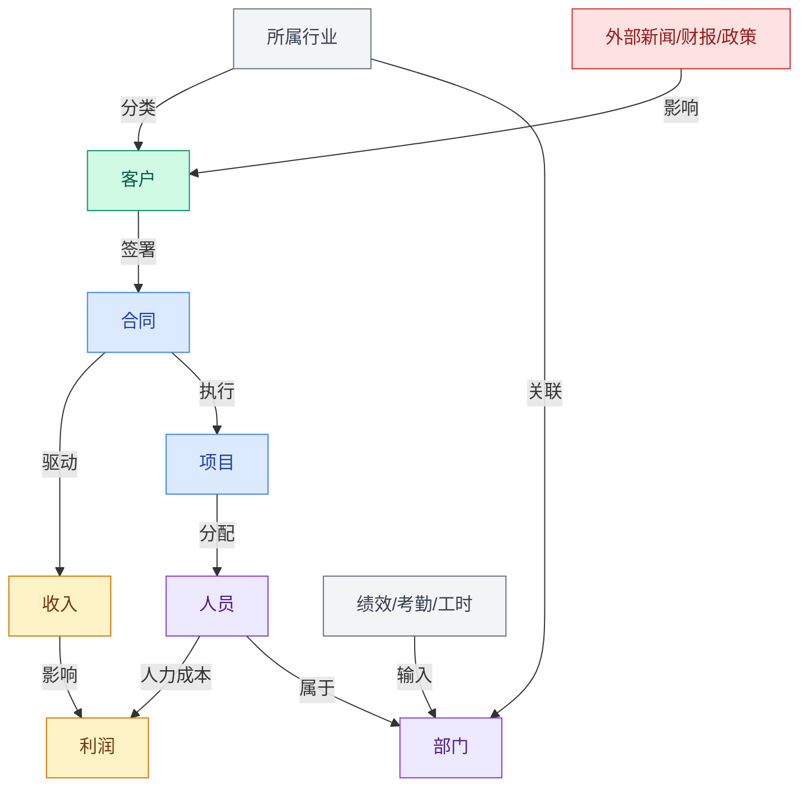

**关键设计原则：每个领域对象都有一个 `health_score`（0-100），由 AI 实时计算。这个评分贯穿所有面板，是 EnterpriseMonitor 的统一度量语言。**

### 2.3 信号-事件-态势三级模型

借鉴 WorldMonitor 的情报分析方法论，EnterpriseMonitor 将信息处理分为三级：

| 层级 | 定义 | 示例 | 处理方式 |
|------|------|------|---------|
| **信号（Signal）** | 原始数据变化 | 某客户30天未回款、某政策文件发布 | AI 自动采集，实时流入 |
| **事件（Event）** | 多信号聚合形成的有意义变化 | 该客户回款异常+负面新闻+负责人离职 = 客户风险事件 | AI 自动关联，生成告警 |
| **态势（Situation）** | 多事件叠加形成的整体格局变化 | 政府行业3个大客户同时出现风险信号 = 行业性风险态势 | AI 分析+人工研判，推送决策层 |

WorldMonitor 用这套方法论追踪地缘冲突。EnterpriseMonitor 用同一套方法论追踪企业经营健康度的变化。

---

## 3. 维度一：内外部信息打通——企业的「边界消融」

### 3.1 核心洞察

WorldMonitor 的本质是什么？是把**原本分散在不同国家、不同机构、不同语言**中的信息，聚合到一个界面上，用地图做空间锚点，用时间轴做时间锚点。

EnterpriseMonitor 要做的「内外打通」，不是简单地在看板旁边加一个新闻栏。而是要实现**每一条外部信息都能找到它在企业内部的「投影」**——它影响哪个客户？它利好还是利空哪条产品线？它可能导致哪个项目的预算被砍？

这就像 WorldMonitor 的「基础设施级联分析」：你点击一条海底电缆，它告诉你断了会影响哪些国家。EnterpriseMonitor 的外部信息打通也是这样：你看到一条政策，它告诉你会影响哪些客户、哪些合同、多少收入。

> **v1.1 核心变更**：外部信息不再作为独立入口呈现（不设「外部站」），而是在每个业务维度（经营/交付/财务/人力）中原生融入相关的外部信息面板。这消除了内外割裂，让决策者在任何业务视角下都能看到完整的 360° 视图。

### 3.2 内部信息域（50%）

内部信息来自品高聆客已有的 27 个应用系统。但关键的变化是：**从「按系统分」变为「按实体分」**。

传统方式：用户要了解某客户，先去 CRM 看商机，再去合同系统看合同，再去项目协管看交付，再去财务看回款。

EnterpriseMonitor 方式：以「客户」为核心实体，一张卡片上聚合���自所有系统的信息。

#### 3.2.1 内部数据聚合表

| 核心实体 | 聚合数据来源 | 聚合后呈现 |
|---------|------------|----------|
| **客户** | CRM（商机/联系人）+ 合同系统（合同额/状态）+ 财务（回款/账龄）+ 项目协管（在建项目/健康度）+ 协作（待办/任务）+ IM（最近沟通记录摘要） | 客户360度卡片 + CHI评分 |
| **项目** | 协作（任务/里程碑）+ 项目协管（审批/工单）+ 工作量填报（工时消耗）+ 合同系统（合同关联）+ 财务（成本/利润率）+ HR（项目成员考勤/绩效） | 项目全景卡片 + PHI评分 |
| **员工** | HR（档案/考勤/绩效/薪酬）+ 协作（任务负载）+ 工作量填报（工时分布）+ IM（活跃度）+ 日程（排期饱和度） | 人效面板行 |
| **部门** | 上述所有按部门聚合 + 招聘（HC/到岗率）+ 绩效（团队OKR达成率） | 部门健康卡片 + DHI评分 |
| **合同** | 合同系统（全生命周期）+ 财务（回款进度）+ 项目（交付进度）+ CRM（客户关联） | 合同执行态势行 |
| **收入** | 合同系统（签约额）+ 财务（确认收入/回款）+ CRM（管道加权值） | 收入脉搏面板 |

### 3.3 外部信息域（50%）

这是 EnterpriseMonitor 与传统看板最根本的区别。外部信息不是「附加」，而是**占整个看板信息量的一半**。

#### 3.3.1 外部信息的七大域

**域一：政策法规**——企业经营的「天花板」

| 信息子类 | 典型来源 | 与企业的关系 |
|---------|---------|------------|
| 国家级政策（国务院、各部委） | 中国政府网、各部委官网 RSS | 直接决定客户预算方向、采购规则、行业准入 |
| 地方政策（省/市/区） | 地方政府网站 | 影响在地项目审批、区域客户预算 |
| 行业标准/规范更新 | 工信部、网信办、公安部等 | 产品合规要求、技术路线调整 |
| 政府采购政策 | 政采云、财政部 | 投标资格、集采目录、价格基准 |
| 数据安全/隐私法规 | 网信办、工信部 | 产品安全合规改造需求 |

**域二：宏观经济**——企业经营的「水位线」

| 信息子类 | 典型来源 | 与企业的关系 |
|---------|---------|------------|
| GDP / PMI / CPI | 国家统计局 | 客户预算松紧的先行指标 |
| 央行利率/货币政策 | 人民银行 | 融资成本、客户资金状况 |
| 财政支出/转移支付 | 财政部 | 政府客户的「钱袋子」变化 |
| 固定资产投资 | 国家统计局 | 基建/信息化类项目的景气度 |
| 行业投融资数据 | IT桔子、天眼查 | 客户/竞对的资金动态 |

**域三：行业动态**——企业竞争的「赛道变化」

| 信息子类 | 典型来源 | 与企业的关系 |
|---------|---------|------------|
| 行业招投标公告 | 各省政采平台、中国招标投标公共服务平台 | 直接的销售机会或竞争情报 |
| 行业展会/峰会 | 行业媒体 | 市场趋势、客户关系维护窗口 |
| 技术趋势报告 | Gartner、IDC、CCID、信通院 | 产品战略方向参考 |
| 开源/标准化动态 | GitHub Trending、信标委 | 技术选型影响 |

**域四：客户外部画像**——从「我知道的客户」到「客户的全貌」

| 信息子类 | 典型来源 | 与企业的关系 |
|---------|---------|------------|
| 客户企业新闻 | 新闻聚合、客户官网 | 客户战略方向变化、决策人变动 |
| 上市客户财报 | 证交所、Wind | 客户预算能力、财务健康度 |
| 客户工商变更 | 天眼查、企查查 | 股权变动、法人变更、经营异常 |
| 客户招聘动态 | 招聘网站 | 客户正在扩张/收缩的业务方向 |
| 客户中标/被中标 | 政采平台 | 客户IT投入方向、我方竞争态势 |

**域五：竞争对手**——「知彼」的自动化

| 信息子类 | 典型来源 | 与企业的关系 |
|---------|---------|------------|
| 竞对产品发布/更新 | 竞对官网、科技媒体 | 产品竞争力基准 |
| 竞对中标信息 | 政采平台 | 我方丢标原因分析 |
| 竞对融资/并购 | 财经媒体、天眼查 | 竞争格局变化 |
| 竞对招聘方向 | 招聘网站 | 竞对战略布局推断 |
| 竞对负面舆情 | 新闻/社交媒体 | 潜在的市场机会窗口 |

**域六：资本市场**——上市企业的「外部体检表」（v1.1 新增）

| 信息子类 | 典型来源 | 与企业的关系 |
|---------|---------|------------|
| 自身股价/市值/估值 | 证交所、Wind、Choice | 市场对企业经营的实时定价 |
| 分析师评级/研报 | 券商研究所 | 机构对企业前景的判断 |
| 股东变动/北向资金 | 证交所、互联互通数据 | 机构投资者动向 |
| 同业估值对比 | Wind、Choice | 相对估值位置 |
| 投资者关系事件 | 互动易、业绩说明会 | IR沟通需求与市场关注焦点 |

**域七：风险与突发**——「黑天鹅」的早期信号

| 信息子类 | 典型来源 | 与企业的关系 |
|---------|---------|------------|
| 自然灾害 | 应急管理部、气象局 | 项目所在地交付风险 |
| 公共卫生事件 | 卫健委 | 人员出行、现场项目影响 |
| 网络安全事件 | CERT、安全媒体 | 产品安全响应、客户安全需求 |
| 重大事故 | 新闻快讯 | 项目/客户/供应商所在地影响 |

### 3.4 内外关联引擎——EnterpriseMonitor 的灵魂

**仅仅并列展示内外部信息是不够的。** WorldMonitor 的精髓在于「图层叠加」——你可以同时看到军事活动和海底电缆，然后你自己判断两者的关系。但 EnterpriseMonitor 要比 WorldMonitor 更进一步：**AI 自动计算内外关联**。

#### 3.4.1 关联机制设计

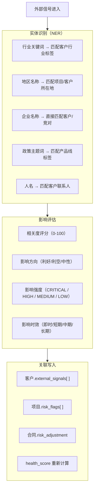

#### 3.4.2 关联示例（完整推演）

**场景一：政策利好捕获**

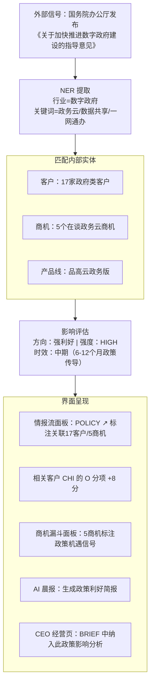

**场景二：客户风险预警**

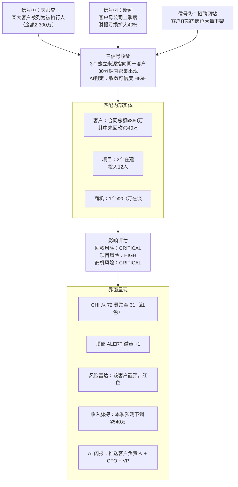

### 3.5 信息融合的界面表达

内外打通不是把两块信息放在一起，而是在**每一个界面元素上都能看到两者的交织**。

| 界面元素 | 仅内部数据（传统） | 内外融合（EnterpriseMonitor） |
|---------|----------------|---------------------------|
| 客户卡片 | 合同额、回款率 | 合同额、回款率 + 外部信号标签 + AI风险评级 |
| 项目行 | 进度条、状态 | 进度条、状态 + 所在地外部风险 + 客户健康联动 |
| 收入数字 | 当前金额 | 当前金额 + AI预测区间 + 外部因素影响量化 |
| 商机漏斗 | 阶段分布 | 阶段分布 + 政策利好/利空标注 + 竞对中标影响 |
| 员工行 | 工时、绩效 | 工时、绩效 + 外部薪酬基准对比 + 离职市场热度 |

---

## 4. 维度二：信息实时性——从「月报文化」到「心跳监测」

### 4.1 为什么实时性是价值的核心

WorldMonitor 的口号里有一个词：**Real-time**。它的 435 个数据源大多是秒级或分钟级刷新的。AIS 船舶数据是 WebSocket 实时流，军机 ADS-B 也是。

企业经营也是如此。信息的价值随时间指数级衰减：

```
信息价值
  │
  │█████
  │████
  │███
  │██
  │█
  │░
  │
  └──────────────────────── 时间
  发生  1小时  1天  1周  1月  1季度

  · 客户被列为被执行人：第一天知道可以止损，一个月后知道已成坏账
  · 政策利好发布：第一天知道可以抢占先机，一个月后竞对已经拿下项目
  · 项目里程碑偏差：第一天���道可以调配资源，一个月后已经逾期
```

### 4.2 四级实时性体系

| 级别 | 代号 | 延迟 | 适用场景 | 技术实现 |
|------|------|------|---------|---------|
| **L1** | 心跳 | ≤10秒 | 严重警报：客户工商异常、合同纠纷立案、系统故障、CRITICAL级AI信号 | WebSocket 双向推送 |
| **L2** | 脉搏 | 1-5分钟 | 业务状态变化：审批完成、合同签署、回款到账、外部新闻、招投标更新 | SSE（Server-Sent Events）+ 短轮询 |
| **L3** | 呼吸 | 15-60分钟 | 聚合指标：项目进度汇总、销售漏斗变化、部门工时统计、EHI评分重算 | 定时聚合任务 |
| **L4** | 节律 | 每日 | 趋势分析：日度收入/成本、人效数据、AI预测模型重训、晨报生成 | 夜间批处理流水线 |

### 4.3 内部数据实时化改造

当前品高聆客的 27 个应用大多采用「用户主动查询」模式。EnterpriseMonitor 需要将它们改造为「事件推送」模式。

#### 4.3.1 关键数据流的实时化方案

| 数据流 | 原始系统 | 当前模式 | 改造方案 | 目标级别 |
|--------|---------|---------|---------|---------|
| 合同签署 | 品高合同系统 | 用户登录查看 | Webhook：签署/变更/终止事件推送 | L1 |
| 回款到账 | 财务系统 | 月度对账 | 银企直连 Webhook + 财务系统 CDC | L1 |
| 审批流转 | 项目协管 OA | 待办列表拉取 | Webhook：每次审批动作推送 | L2 |
| 商机推进 | 品高 CRM | 用户手动更新 | CDC（Change Data Capture）监听 CRM 数据库变更 | L2 |
| 任务状态 | 协作平台 | 用户操作时更新 | Webhook + CDC | L2 |
| 工时数据 | 工作量填报 | 周度填报 | 保持周度，但填报后即时聚合 | L3 |
| 考勤数据 | 假勤系统 | 每日统计 | 打卡设备实时推送 + 异常即时告警 | L2 |
| 绩效数据 | 绩效系统 | 季度评估 | 保持季度，但 OKR 进度实时同步 | L4+实时 OKR |
| 招聘进度 | 招聘系统 | 用户登录查看 | Webhook：简历/面试/offer 状态变更 | L2 |

#### 4.3.2 CDC 实现方案

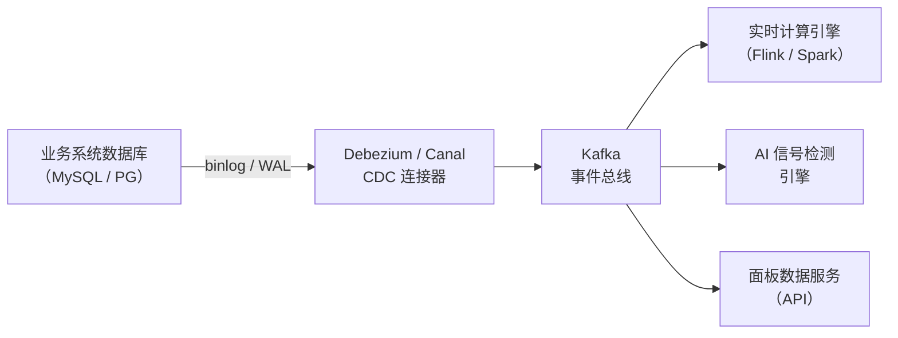

### 4.4 外部数据实时采集

| 外部数据类型 | 采集方式 | 采集频��� | 延迟 |
|------------|---------|---------|------|
| 政府官网政策 | RSS 轮询 + 网页变更检测 | 每 5 分钟 | L2 |
| 招投标公告 | 政采平台 API + 爬虫 | 每 10 分钟 | L2 |
| 财经新闻 | RSS 聚合（新华社/财新/一财等 50+ 源） | 每 2 分钟 | L2 |
| 企业工商变更 | 天眼查/企查查 Webhook API | 事件触发 | L1 |
| 上市客户股价 | 证券数据 WebSocket | 实时 | L1（交易时段） |
| 自身股价/资本市场 | 证券数据 WebSocket + 研报API | 实时 | L1（交易时段） |
| 宏观经济数据 | 统计局 API + Wind API | 发布即采 | L2 |
| 竞对动态 | 官网变更检测 + 新闻 RSS + 招聘爬虫 | 每 30 分钟 | L3 |
| 灾害/气象 | 应急管理部 API + 气象局 API | 每 5 分钟 | L2 |
| 社交媒体/公众号 | 授权 API + 爬虫 | 每 15 分钟 | L2 |

### 4.5 时间轴回放与快照对比

借鉴 WorldMonitor 的时间轴筛选器（1h/6h/24h/48h/7d/全部），EnterpriseMonitor 提供更贴合企业节奏的时间维度：

```
[实时] [1h] [今日] [本周] [本月] [本季] [YTD] [同比] [自定义]
```

**快照 Diff 功能**——这是 WorldMonitor 没有但企业场景急需的：
- 任意两个时间点的状态对比
- 例如：「上周五 vs 今天」——哪些客户的健康度下降了？哪些项目新增了风险信号？本周新签了多少？
- AI 自动生成 Diff 摘要：「本周最大变化：客户A的CHI下降12分（原因：回款逾期30天+外部负面新闻），项目B新增逾期风险（里程碑延迟8天），新增政策利好信号3条（涉及数字政府方向）」

---

## 5. 维度三：信息密度与丰富度——每个像素都承载决策价值

### 5.1 WorldMonitor 的密度启示

WorldMonitor 右侧面板栏总内容高度约 8980px，包含十余个面板，每个面板都塞满了信息。它的设计原则是：**一屏之内尽可能多地呈现决策相关信息，减少翻页和跳转**。

传统企业看板呢？首屏往往只有 4-6 个大卡片，每个卡片只有一个数字和一个标题。信息密度差距在 **10倍以上**。

### 5.2 密度提升的五大设计手法

#### 手法一：数字 + 趋势 + 对比 = 一行三维

传统：`本月收入：2,400万`（一个维度）

EnterpriseMonitor：`本月收入 ¥2,400万 ↑12% █████████░ 75%达成 AI:87%可达标`（五个维度：绝对值 + 环比 + 进度条 + 达成率 + AI预测）

#### 手法二：颜色即语义——五色系统

所有数据都自动着色，无需阅读就能感知好坏：

| 颜色 | 语义 | 适用场景 |
|------|------|---------|
| 绿 | 健康 / 超预期 / 利好 | 健康度 80+、收入超标、政策利好 |
| 蓝 | 正常 / 符合预期 | 健康度 60-79、进度正常 |
| 黄 | 需关注 / 轻微偏差 | 健康度 40-59、轻微逾期 |
| 橙 | 风险 / 明显偏差 | 健康度 20-39、严重偏差 |
| 红 | 危险 / CRITICAL | 健康度 <20、合同纠纷、客户破产 |

#### 手法三：Sparkline 迷你图——趋势不占空间

每一个关键数字旁边都配一条 30 日 Sparkline 迷你趋势线，高度仅 16px，但能让用户瞬间看出趋势方向。

```
客户A  CHI:82 ▁▂▃▄▅▆▇██ ↑   回款:¥680万 ████████░░ 85%
客户B  CHI:45 █▇▆▅▄▃▂▁▁ ↓↓  回款:¥120万 ███░░░░░░░ 30% ⚠
```

#### 手法四：信息分层——概览/详情/钻取

每个面板支持三层深度，用户按需展开：

| 层 | 交互 | 信息量 |
|----|------|--------|
| **L1 概览** | 面板标题行 | 1个核心数字 + 趋势 + 状态色 |
| **L2 列表** | 面板展开 | 所有实体的评分排行 + Sparkline |
| **L3 钻取** | 点击某行 | 该实体的 360 度详情（弹出弹窗） |

#### 手法五：标签即维度——状态标签体系

借鉴 WorldMonitor 的 ONGOING / ALERT / BREAKING 标签系统，EnterpriseMonitor 定义企业标签体系：

**信号标签（AI 自动标注）**

| 标签 | 含义 | 颜色 |
|------|------|------|
| `CRITICAL` | 需立即处理 | 红底白字 |
| `ALERT` | 需要关注 | 橙底白字 |
| `RISK` | 存在风险 | 黄底黑字 |
| `OPPORTUNITY` | 机会信号 | 绿底白字 |
| `TRENDING` | 趋势变化 | 蓝底白字 |
| `AI INSIGHT` | AI 发现的洞察 | 紫底白字 |
| `EXTERNAL` | 来自外部信息 | 灰底白字 |
| `STALE` | 数据可能过时 | 灰底灰字 |

**业务标签（系统 + 用户）**

| 标签 | 含义 |
|------|------|
| `OVERDUE` | 逾期 |
| `ON TRACK` | 按计划进行 |
| `BLOCKED` | 被阻塞 |
| `NEW` | 新增 |
| `CLOSING` | 即将成单 |
| `CHURNING` | 流失风险 |

### 5.3 信息密度实测对比

以「客户概览」为例，同一屏幕（1920×400px 区域）能展示的信息量对比：

**传统看板**（4 个大卡片）：
```
┌──────────┐ ┌──────────┐ ┌──────────┐ ┌──────────┐
│ 客户总数  │ │ 新增客户  │ │ 合同总额  │ │ 回款总额  │
│   142    │ │    8     │ │  1.2亿   │ │  8400万  │
└──────────┘ └──────────┘ └──────────┘ └──────────┘
信息量：4 个数字，0 个趋势，0 个 AI 分析
```

**EnterpriseMonitor**（高密度面板）：
```
┌────────────────────────────────────────────────────────────────┐
│ 客户风险雷达   ALERT:3  RISK:7  HEALTHY:132   [1h][今日][7d]    │
├────────────────────────────────────────────────────────────────┤
│ 客户名            CHI  R   E   D   O  趋势30d   合同额  回款率 │
│ ─────────────────────────────────────────────────────────────  │
│ 某市公安平台   23  ●18 ●35 ●20 ●19 █▇▅▃▂▁▁  ¥340万  18% ⚠   │
│  └ [CRITICAL] 客户被列为被执行人 · [ALERT] 项目逾期23天        │
│ 某省交通集团   31  ●25 ●40 ●30 ●28 ▇▆▅▄▃▂▁  ¥520万  25%     │
│  └ [RISK] 母公司财报亏损 · [ALERT] 2笔回款超期60天            │
│ 某省政务云     72  ●70 ●80 ●65 ●75 ▅▆▆▇▇▇█  ¥1240万 78%     │
│  └ [OPPORTUNITY] 国务院数字政府新政利好 · [CLOSING] 扩容商机   │
│ 某央企总部     91  ●95 ●88 ●90 ●92 ▇▇████████ ¥2100万 95%   │
│ 更多 132 个客户...                          [展开完整列表 ▾]   │
├────────────────────────────────────────────────────────────────┤
│ AI 摘要：本周3家客户CHI显著下降，主因：外部工商异常信号+回款逾  │
│ 期。建议优先处理某市公安平台（¥340万回款风险）。政策面利好数字   │
│ 政府方向，5家政府客户CHI有望上行。                              │
└────────────────────────────────────────────────────────────────┘
信息量：约90个信息点，传统4个 → 22.5 倍密度提升
```

---

## 6. 维度四：AI 参与度——从「数据搬运工」到「经营参谋部」

### 6.1 WorldMonitor 的 AI 做了什么

WorldMonitor 的 AI 能力是分层的，值得仔细拆解：

| AI 能力层 | WorldMonitor 实现 | 核心价值 |
|----------|------------------|---------|
| **摘要层** | 344 个 RSS 源 → AI 生成 WORLD BRIEF | 海量信息压缩为可消化的段落 |
| **检测层** | 12 种信号类型（收敛/三角验证/速度峰值等） | 从噪声中自动提取有意义的变化 |
| **评估层** | CII 国家不稳定指数（4 维度，0-100） | 将复杂态势压缩为可比较的数字 |
| **预测层** | AI Forecasts（结合 Polymarket 预测市场） | 对未来事件给出概率估计 |
| **收敛层** | 地理收敛检测（1°×1° 网格，3+ 事件���型） | 自动发现多事件在时空上的聚集 |
| **级联层** | 基础设施级联分析（350 节点依赖图） | 模拟一个节点失效对全网络的影响 |
| **本地化** | ONNX Runtime Web 浏览器端推理 | 离线可用，零云端依赖兜底 |

这七层 AI 能力，EnterpriseMonitor 要全部对标实现，且在企业场景下深化。

### 6.2 EnterpriseMonitor 的 AI 七层架构

#### 第一层：AI 摘要引擎——「情报分析官」

**不是简单的数据汇总，而是「说人话的经营分析」。**

传统 BI 输出：`本月收入 2,400 万，环比 +12%，同比 -3%`

AI 摘要引擎输出：

> **本月经营摘要（截至 4月8日）**
> 
> 收入 ¥2,400 万，达成率 75%，按当前节奏月底预计可达 ¥3,050 万（达成率 95%），置信度 82%。主要支撑来自某央企项目验收（¥680 万确认收入）和某省政务云二期回款（¥450 万）。
> 
> **需要关注**：某市公安平台 ¥340 万回款已逾期 45 天，客户被发现工商异常，建议本周内完成法务评估。若该笔回款无法收回，月度达成率将降至 84%。
> 
> **积极信号**：国务院数字政府新政发布，预计带动 Q3 政务云方向商机增长。5 家政府客户的销售负责人已收到跟进建议。

AI 摘要引擎覆盖的输出场景：

| 摘要类型 | 触发方式 | 内容 | 推送渠道 |
|---------|---------|------|---------|
| **晨报** | 每日 08:30 | 昨日回顾 + 今日重点 + 外部情报 + AI关注 | 品高聆客消息 + 邮件 |
| **周报** | 每周一 09:00 | 本周经营全景 + 快照Diff + 预测调整 | 品高聆客 + 邮件 |
| **闪报** | 事件触发 | CRITICAL/HIGH 信号的即时分析 | 品高聆客 + 短信（仅CRITICAL） |
| **面板摘要** | 实时 | 每个面板底部的 2-3 行 AI 总结 | 面板内嵌 |
| **对话式** | 用户提问 | 自然语言查询的回答 | AI 对话窗口 |
| **会议简报** | 会议前 30 分钟 | 经管会/月会的数据简报自动生成 | 品高聆客 + 邮件 |

AI 摘要引擎的调用链（借鉴 WorldMonitor 的四级调用链）：

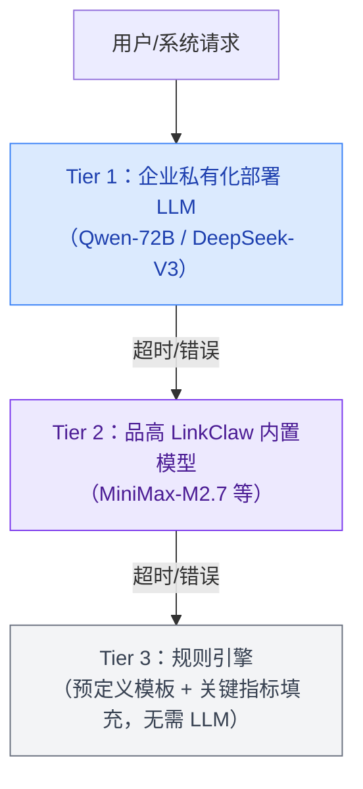

注意：与 WorldMonitor 不同，EnterpriseMonitor **不使用公有云 LLM 作为兜底**（企业数据安全要求），而是用规则引擎作为最终兜底。

#### 第二层：AI 信号检测引擎——「风险预警员」

对标 WorldMonitor 的 12 种信号类型，EnterpriseMonitor 定义 **16 种企业经营信号**：

**收入与回款信号（4 种）**

| 编号 | 信号名称 | 触发条件 | 级别 | 推送对象 |
|------|---------|---------|------|---------|
| S01 | 收入收敛 | 3+ 大单同期进入确认/回款节点 | INFO | CFO、财务 |
| S02 | 回款预警 | 单笔回款逾期 >30天 且 近7天无跟进 | HIGH | 客户负责人、财务 |
| S03 | 坏账风险 | 回款逾期 >90天 或 客户出现工商异常 | CRITICAL | CFO、法务、客户负责人 |
| S04 | 收入预测下调 | AI 月度收入预测值 较上周下降 >10% | HIGH | CEO、CFO |

**客户信号（3 种）**

| 编号 | 信号名称 | 触发条件 | 级别 | 推送对象 |
|------|---------|---------|------|---------|
| S05 | 客户外部异动 | 客户企业出现负面新闻/工商异常/高管变动 | HIGH | 客户负责人、VP |
| S06 | 客户沉默 | 客户 30天 无任何互动（无会议/无消息/无需求） | MEDIUM | 客户负责人 |
| S07 | 客户机遇 | 客户发布正面信号（新���资/新项目/扩张计划） | INFO | 客户负责人、销售VP |

**项目与交付信号（4 种）**

| 编号 | 信号名称 | 触发条件 | 级别 | 推送对象 |
|------|---------|---------|------|---------|
| S08 | 交付风险 | 里程碑偏差 >10天 或 PHI 连续3天下降 >5分 | HIGH | PM、交付VP |
| S09 | 毛利侵蚀 | 项目实际工时超预算 >20%，毛利率预测 <预警线 | HIGH | PM、CFO |
| S10 | 关键人风险 | 项目核心成员（架构师/PM）提出离职 或 连续异常考勤 | CRITICAL | PM、HR、交付VP |
| S11 | 验收加速 | 项目验收节点提前完成，可确认收入 | INFO | PM、CFO |

**人力信号（2 种）**

| 编号 | 信号名称 | 触发条件 | 级别 | 推送对象 |
|------|---------|---------|------|---------|
| S12 | 资源瓶颈 | 某技能池（如 Java高级/产品经理）利用率 >90% | MEDIUM | HR、资源调度 |
| S13 | 离职预警 | AI 综合分析：考勤异常 + 绩效下降 + 简历更新��如有授权数据） | HIGH | HR、直属上级 |

**外部环境信号（3 种）**

| 编号 | 信号名称 | 触发条件 | 级别 | 推送对象 |
|------|---------|---------|------|---------|
| S14 | 政策机遇 | 新政策与企业业务方向高度匹配（AI 相关度 >0.8） | INFO | CEO、销售VP |
| S15 | 竞争威胁 | 竞对在我方核心赛道发布重磅产品/大幅降价/拿下标杆客户 | HIGH | 产品、销售VP |
| S16 | 多信号收敛 | 同一客户/项目在 24h 内出现 3+ 种不同类型信号 | 动态升级 | 根据实体负责人 |

**S16 是最重要的信号**，直接对标 WorldMonitor 的地理收敛检测。当多个独立信号指向同一个业务实体时，即使每个信号单独看级别不高，收敛后也可能意味着重大风险或机会。

```
收敛检测公式（对标 WM 的 convergence_score）：

convergence_score = min(100, signal_types × 25 + min(25, total_signals × 3))

| 类型数 | 分数区间 | 结果 |
|--------|---------|------|
| 4+ 种  | 80-100  | 自动升级为 CRITICAL，立即推送 |
| 3 种   | 60-80   | 自动升级为 HIGH |
| 2 种   | 40-60   | 保持各信号原级别，但标注收敛 |
```

#### 第三层：AI 综合评分引擎——「体检报告」

这是 EnterpriseMonitor 最核心的 AI 输出，对标 WorldMonitor 的 CII（Country Instability Index）。

**企业健康指数体系（Enterprise Health Index, EHI）**

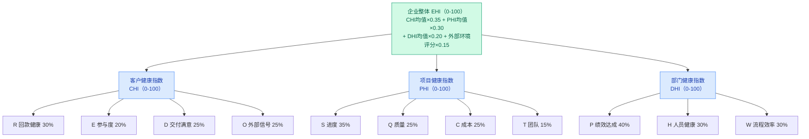

**CHI（客户健康指数）四维度**

| 维度 | 代号 | 权重 | 数据来源 | 计算逻辑 |
|------|------|------|---------|---------|
| 回款健康 | R | 30% | 财务系统 | 回款率 × 0.4 + 账龄健康度 × 0.3 + 逾期金额占比反转 × 0.3 |
| 参与度 | E | 20% | CRM + IM | 近30天沟通次数归一化 × 0.4 + 需求提交频率 × 0.3 + 最后互动天数反转 × 0.3 |
| 交付满意 | D | 25% | 协作 + 项目协管 | 里程碑达成率 × 0.4 + 验收一次通过率 × 0.3 + 工单关闭时效 × 0.3 |
| 外部信号 | O | 25% | 外部数据源 + AI | 企业信用评分 × 0.3 + 外部新闻情感分 × 0.3 + 行业景气度 × 0.2 + 政策影响分 × 0.2 |

**PHI（项目健康指数）四维度**

| 维度 | 代号 | 权重 | 数据来源 | 计算逻辑 |
|------|------|------|---------|---------|
| 进度 | S | 35% | 协作 + 项目协管 | 里程碑达成率 × 0.5 + 计划偏差天数归一化 × 0.3 + 任务完成率 × 0.2 |
| 质量 | Q | 25% | 工单系统 + 项目协管 | Bug密度反转 × 0.4 + 验收通过率 × 0.3 + 返工次数反转 × 0.3 |
| 成本 | C | 25% | 工作量填报 + 财务 | 工时偏差率反转 × 0.5 + 毛利率归一化 × 0.5 |
| 团队 | T | 15% | HR + 考勤 + 协作 | 核心人员在岗率 × 0.4 + 工时饱和度适中率 × 0.3 + 团队沟通活跃度 × 0.3 |

**DHI（部门健康指数）三维度**

| 维度 | 代号 | 权重 | 数据来源 | 计算逻辑 |
|------|------|------|---------|---------|
| 绩效达成 | P | 40% | 绩效系统 | OKR/KPI 达成率加权 |
| 人员健康 | H | 30% | HR + 考勤 | 离职率反转 × 0.3 + 工时异常率反转 × 0.3 + 满意度 × 0.2 + 招聘到岗率 × 0.2 |
| 流程效率 | W | 30% | 项目协管 + OA | 待办处理时效 × 0.4 + 审批周期 × 0.3 + 协作响应速度 × 0.3 |

#### 第四层：AI 预测引擎——「水晶球」

对标 WorldMonitor 的 AI Forecasts 面板（结合 Polymarket 预测市场），EnterpriseMonitor 提供企业级预测：

| 预测项 | 输入特征 | 模型 | 输出 | 刷新频率 |
|--------|---------|------|------|---------|
| 月度收入预测 | 已确认收入 + 管道加权 + 历史季节性 + 回款趋势 | 时序回归 + LLM校正 | 预测值 ± 区间 + 置信度% | 每日 |
| 商机成单概率 | 推进阶段 + 停留时长 + 互动频率 + 客户CHI + 竞对情报 | 分类模型 | 概率% + 影响因素排序 | 实时（商机变化时） |
| 项目按时交付 | PHI趋势 + 里程碑偏差 + 资源缺口 + 历史同类项目 | 生存分析 | 概率% + 风险因素 | 每日 |
| 季度OKR达成 | 当前进度 + 历史达成率 + 剩余时间 + 外部因素 | 回归 + LLM | 概率% + 关键路径 | 每周 |
| 客户续约概率 | CHI趋势 + 合同到期日 + 竞对动态 + 使用数据 | 分类模型 | 概率% + 挽留建议 | 每月 |
| 关键人离职风险 | 行为模式变化 + 绩效趋势 + 市场薪酬对比 + 在职时长 | 异常检测 | 风险等级 + 预警信号 | 每周 |
| 年度收入目标 | 全量历史 + 管道 + 宏观经济 + 行业趋势 + 政策环境 | 综合模型 | 预测值 + 场景分析（乐观/基准/悲观）| 每月 |

#### 第五层：AI 收敛检测引擎——「态势感知」

对标 WorldMonitor 的地理收敛检测（1°×1° 网格）和灾难级联（Disaster Cascade），EnterpriseMonitor 实现**业务实体收敛检测**。

核心思想：当一个业务实体周围的信号密度超过阈值时，即使单个信号不严重，组合起来也可能意味着重大问题。

```python
# 收敛检测伪代码
for entity in [客户, 项目, 部门, 产品线]:
    signals_24h = get_signals(entity, window="24h")
    signal_types = count_distinct_types(signals_24h)
    
    if signal_types >= 3:
        score = calculate_convergence_score(signal_types, len(signals_24h))
        
        if score >= 80:
            emit(CRITICAL_CONVERGENCE, entity, signals_24h)   # 立即推送决策层
        elif score >= 60:
            emit(HIGH_CONVERGENCE, entity, signals_24h)        # 纳入闪报
        else:
            emit(MEDIUM_CONVERGENCE, entity, signals_24h)      # 标注在面板上
```

#### 第六层：AI 级联分析引擎——「蝴蝶效应模拟」

对标 WorldMonitor 的基础设施级联分析（350 节点依赖图谱），EnterpriseMonitor 构建**企业依赖关系图谱**，模拟某个节点出问题对整个企业的连锁影响。

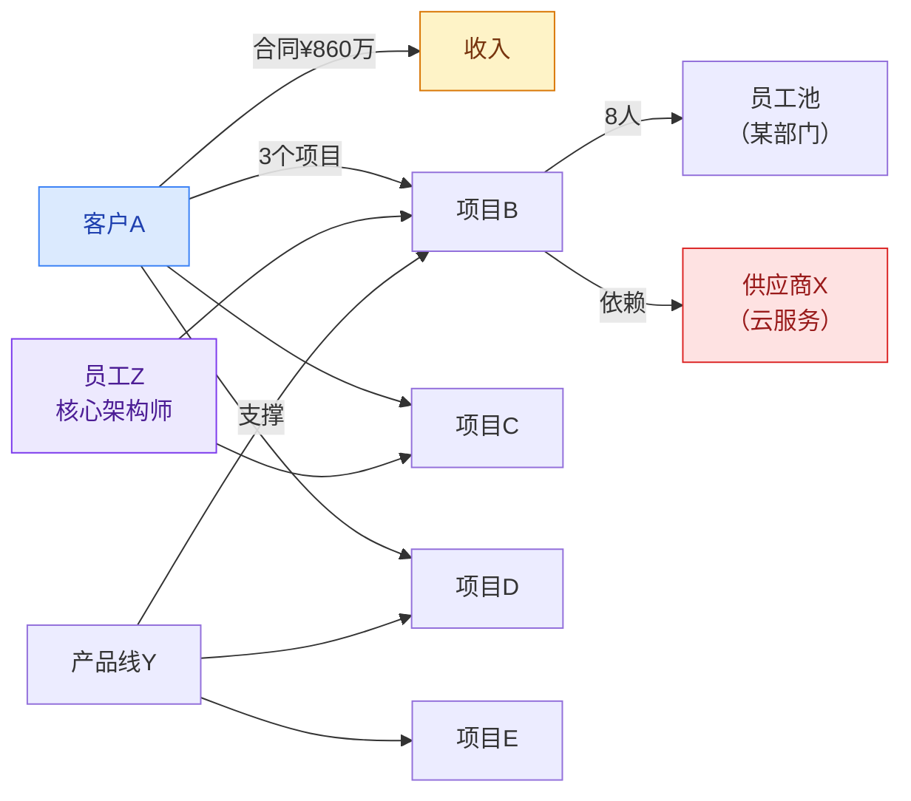

**级联计算**（对标 WM 的 BFS 广播 + 3 层深度）：

```
cascade_impact(node) = Σ (edge_strength × disruption_level × (1 - redundancy))
```

| 参数 | 说明 |
|------|------|
| edge_strength | 边的强度（如合同金额占比、人员依赖程度） |
| disruption_level | 中断程度（0-1，完全丢失=1，部分影响=0.3-0.7） |
| redundancy | 冗余度（有替代方案=0.8，无替代=0） |

**交互方式**：用户点击任意节点（如「某供应商X」），系统自动计算并高亮所有受影响节点，标注影响等级。

#### 第七层：AI 自然语言交互——「随时可问的参谋」

对标 WorldMonitor 的 Cmd+K 全局搜索，EnterpriseMonitor 提供全时在线的 AI 对话能力。

**对话能力矩阵**：

| 查询类型 | 示例 | AI 处理方式 |
|---------|------|-----------|
| 数据查询 | "本月签了多少新合同？" | 直接查询聚合数据返回 |
| 趋势分析 | "回款率为什么比上月下降了？" | 对比两期数据，归因到具体客户/合同 |
| 预测追问 | "如果张三离职了，哪些项目受影响最大？" | 调用级联分析引擎，模拟场景 |
| 策略建议 | "Q3 要完成 5000 万收入目标，哪些商机最有希望？" | 调用预测引擎，按成单概率排序 |
| 外部关联 | "最近有什么政策对我们有利？" | 检索外部信号中的利好信号，关联内部产品线 |
| 对比分析 | "和去年同期比，我们的经营状况怎么样？" | 同比数据全面对比 + AI 解读 |
| What-if | "如果丢掉某央企这个客户，收入缺口有多大？" | 模拟客户流失的级联影响 |

---

## 7. 整体界面架构与交互设计

### 7.1 设计哲学

WorldMonitor 的界面哲学是：**地图为中心，面板为两翼，顶栏为状态**。这个布局经过 2M+ 月活的验证，是高密度信息呈现的最优结构。EnterpriseMonitor 完整继承这一结构，做企业化适配。

### 7.2 主界面布局

```
┌────────────────────────────────────────────────────────────────────────────┐
│ ┌──────────────────────────── 顶部状态栏 ───────────────────────────────┐  │
│ │ [EHI:74▲] [🔴3 🟠7] [收入██████░░░75%] [经营|交付|财务|人力]          │  │
│ │                                    [⌘K搜索] [实时|1h|今日|7d|30d] [⚙] │  │
│ └────────────────────────────────────────────────────────────────────────┘  │
│ ┌───────────────────────────────────────┬────────────────────────────────┐ │
│ │                                       │                                │ │
│ │        中央主视图区（左栏 60%）          │     右侧面板滚动栏（40%）        │ │
│ │                                       │                                │ │
│ │  ┌─────────────────────────────┐      │   ┌────────────────────────┐   │ │
│ │  │   地理地图                    │      │   │P01 AI经营态势 BRIEF    │   │ │
│ │  │   （客户/项目/人员分布）       │      │   │                        │   │ │
│ │  │    或 网格看板                │      │   ├────────────────────────┤   │ │
│ │  │   （高密度仪表盘视图）        │      │   │P02 企业健康指数 EHI     │   │ │
│ │  └─────────────────────────────┘      │   ├────────────────────────┤   │ │
│ │                                       │   │P03 收入脉搏             │   │ │
│ │  ┌──────────────┬──────────────┐      │   ├────────────────────────┤   │ │
│ │  │ 概览数字卡片  │ 趋势图表区    │      │   │P04-P16 ...            │   │ │
│ │  │ (4-6个KPI)  │ (Sparkline)  │      │   │（按维度动态组合）       │   │ │
│ │  └──────────────┴──────────────┘      │   ├────────────────────────┤   │ │
│ │                                       │   │ AI 对话入口             │   │ │
│ │                                       │   └────────────────────────┘   │ │
│ └───────────────────────────────────────┴────────────────────────────────┘ │
└────────────────────────────────────────────────────────────────────────────┘
```

### 7.3 顶部状态栏详细设计

顶部状态栏是整个界面中**信息密度最高的一行**，对标 WorldMonitor 的 `[DEFCON] [地图控件] [⌘K] [区域筛选] [设置]`。

| 元素 | 类比 WM | 功能 |
|------|--------|------|
| **EHI 评分** | DEFCON 警报 | 企业整体健康度 0-100，颜色编码，趋势箭头，点击展开详情 |
| **ALERT 徽章** | 无（WM 无统一告警计数） | 当前未处理的 CRITICAL（红）和 HIGH（橙）信号数量 |
| **收入进度条** | 无 | 本月/季度收入达成率，带绝对值和百分比，鼠标悬浮显示AI预测 |
| **专题切换** | 五站切换 Tabs | **四个专题站**（经营/交付/财务/人力），切换后中央区和面板栏内容变化 |
| **⌘K 搜索** | Cmd+K 全局搜索 | 搜索客户/项目/员工/合同/外部信息，支持自然语言 |
| **时间轴** | 时间轴筛选器 | 控制所有面板的时间窗口 |
| **视图切换** | 2D/3D 切换 | 地图视图 vs 网格看板视图 |

### 7.4 四大专题站

> **v1.1 核心变更**：原设计的「五大专题站」中，「外部站」已被取消。外部信息不应作为独立维度存在——在经营、交付、财务、人力等每个维度下，都同时存在内部和外部信息，二者天然交织。因此，外部信息面板（资本市场、政策监控、竞争情报、宏观经济、人才市场、供应商生态）已整合到各维度中，实现真正的内外融合。

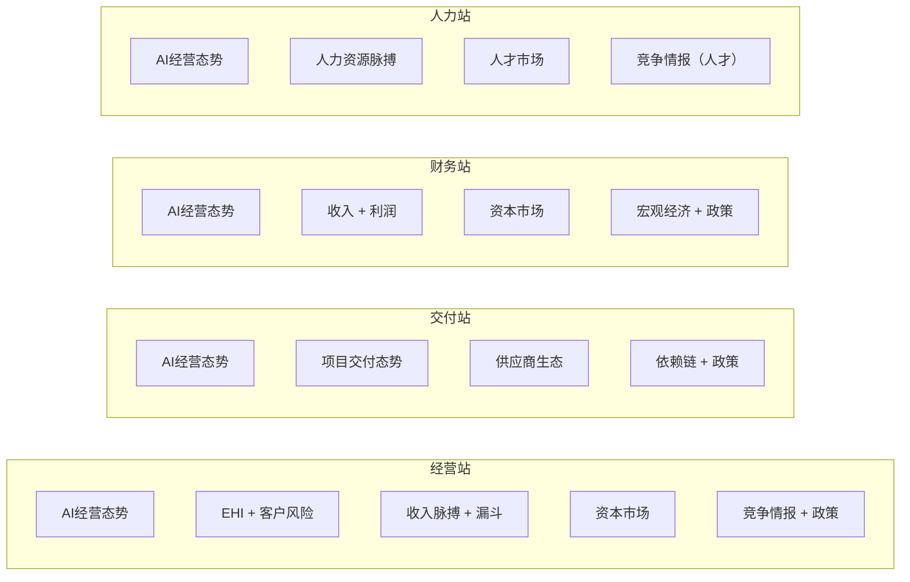

| 站 | 名称 | 聚焦 | 中央区主视图 | 右侧面板组（含外部信息） | 类比 WM |
|----|------|------|-----------|---------------------|--------|
| 1 | **经营站** | 收入·客户·商机·合同·市场 | 客户分布地图 / 收入仪表盘 | AI态势+EHI+收入+漏斗+客户+**资本市场**+**竞争情报**+**政策** | 世界站 |
| 2 | **交付站** | 项目·里程碑·质量·资源·供应商 | 项目分布地图 / 项目看板 | AI态势+项目+EHI+**供应商生态**+依赖链+HR+**政策** | 科技站 |
| 3 | **财务站** | 现金流·成本·利润·预算·估值 | 收入/成本趋势图表 | AI态势+利润+**资本市场**+EHI+**宏观经济**+漏斗+**政策**+依赖链 | 金融站 |
| 4 | **人力站** | 人员·绩效·招聘·人效·人才竞争 | 人员分布地图 / 人效矩阵 | AI态势+HR+**人才市场**+EHI+项目+依赖链+**竞争情报** | 大宗商品站 |

### 7.5 地图图层

对标 WorldMonitor 的 49 个图层开关，EnterpriseMonitor 提供 8 个企业图层：

| 图层 | 内容 | 类比 WM 图层 |
|------|------|-------------|
| ☑ 客户分布 | 按省市标注客户，气泡大小=合同额，颜色=CHI | 经济中心 |
| ☑ 项目交付地 | 在建项目标注，颜色=PHI | 冲突区 |
| ☑ 风险热区 | CHI<40 的客户所在区域高亮 | CII 热力图 |
| ☐ 招投标热点 | 各地最新招投标公告密度 | 抗议活动 |
| ☐ 人员分布 | 员工所在城市（含出差中） | 军事活动 |
| ☐ 供应商分布 | 关键供应商位置 | 基础设施 |
| ☐ 竞对足迹 | 竞争对手中标/客户分布 | 军事基地 |
| ☐ 外部风险 | 灾害/政策变动区域 | 天气预警 |

### 7.6 中央主视图区

中央区支持两种模式：

**模式一：地理地图**
- 技术栈：deck.gl + MapLibre GL（复用 WM 验证过的方案）
- 底图：高德/天地图（国内合规），OpenStreetMap（海外客户场景）
- 图层叠加渲染：WebGL 加速
- 交互：点击实体 → 弹出信息卡片 → 可钻取到详情

**模式二：网格看板**
- 当用户不需要地理信息时，切换为高密度数据网格
- 适合需要快速扫描大量实体评分的场景

### 7.7 右侧面板滚动栏

面板特性（继承 WM 设计）：
- **可拖拽排序**：用户可自定义面板顺序
- **可折叠/展开**：每个面板可独立折叠
- **可见性开关**：不需要的面板可隐藏
- **状态持久化**：面板顺序和展开状态存入用户偏好
- **分享链接**：当前面板状态可生成分享 URL

### 7.8 ⌘K 全局搜索

搜索覆盖范围：

| 搜索范围 | 示例 | 数量级 |
|---------|------|--------|
| 客户 | "某某银行" | 100-500 |
| 项目 | "广州地铁" | 50-200 |
| 员工 | "张三" | 500-5000 |
| 合同 | "2026-GZDT-001" | 200-2000 |
| 商机 | "政务云" | 50-500 |
| 外部新闻 | "数字政府政策" | 实时流 |
| 命令 | "查看收入报表"、"切换到交付站" | 50+ |
| AI 查询 | "本月哪些客户回款风险最高？" | 自然语言 |

搜索结果按类型分组显示，支持键盘快速导航（↑↓ 切换，Enter 确认，Esc 关闭），首次响应 <200ms。

---

## 8. 核心面板详述

> v1.1 更新：从原「十二大核心面板」扩展为 **十六个面板**，新增资本市场、宏观经济、人才市场、供应商生态四个外部信息面板，并将其融入各专题站。

### 面板总览

| 编号 | 面板名称 | 信息域 | 所在专题站 |
|------|---------|--------|-----------|
| P01 | AI 经营态势 BRIEF | 综合 | 全部 |
| P02 | 企业健康指数 EHI | 综合 | 全部 |
| P03 | 收入脉搏 | 内部 | 经营、财务 |
| P04 | 客户风险雷达 | 内+外 | 经营 |
| P05 | 项目交付态势 | 内部 | 交付 |
| P06 | 商机漏斗实况 | 内+外 | 经营 |
| P07 | 外部情报流 | 外部 | 经营、交付、人力 |
| P08 | 人力资源脉搏 | 内部 | 人力 |
| P09 | 供应商/客户依赖分析 | 内+外 | 交付、经营 |
| P10 | AI 预测预报 | AI | 经营、财务 |
| P11 | 政策监控流 | 外部 | 经营、交付、财务 |
| P12 | 竞争情报 | 外部 | 经营、人力、财务 |
| **P13** | **资本市场** | **外部** | **经营、财务** |
| **P14** | **宏观经济** | **外部** | **财务** |
| **P15** | **人才市场** | **外部** | **人力** |
| **P16** | **供应商生态** | **外部** | **交付** |

### P01：AI 经营态势 BRIEF

**对标 WM**：AI 洞察 + AI 战略态势面板

这是 EnterpriseMonitor 的**首屏第一面板**，用一段 AI 生成的文字概括企业当前经营态势。

```
┌────────────────────────────────────────────────────────────┐
│ AI 经营态势 BRIEF                         更新于 2分钟前    │
├────────────────────────────────────────────────────────────┤
│ ┌─────────────────────────┬──────────────────────────────┐ │
│ │ 经营摘要                 │ 关键指标仪表盘                │ │
│ │                         │                              │ │
│ │ 截至4月8日15:30，        │ 本月收入  ¥2,400万  75% ↑   │ │
│ │ 本月收入达成率75%，       │ 在建项目  23个   健康18 ⚠5  │ │
│ │ AI预测月底可达95%。      │ 新签合同  ¥680万  ███░░ 68% │ │
│ │                         │ 回款率    63%     ↓3% ⚠     │ │
│ │ 利好：某央企项目本周      │ 商机管道  ¥8,400万 ↑23%    │ │
│ │ 验收（¥680万），政务云    │ EHI      74 ▲ (+2 vs上周)  │ │
│ │ 方向获政策利好。          │ ALERT    3(红)  7(橙)      │ │
│ │                         │                              │ │
│ │ 关注：某市公安项目多      │ ── 外部环境 ──              │ │
│ │ 信号收敛（收敛评分87），  │ 政策面    中性偏利好 ↗       │ │
│ │ 建议24h内止损会议。      │ 行业景气  PMI 50.8 ↑       │ │
│ │                         │ 竞对动态  2条HIGH信号        │ │
│ │ 关注：回款率63%环比      │ 宏观经济  GDP预期 5.2%      │ │
│ │ 降3%，3笔大额逾期。     │ 资本市场  ¥42.85 ↑2.96%    │ │
│ └─────────────────────────┴──────────────────────────────┘ │
└────────────────────────────────────────────────────────────┘
```

### P02：企业健康指数（EHI）面板

**对标 WM**：CII 国家不稳定指数面板

（详细设计见 6.2 第三层 EHI 架构图）

### P03：收入脉搏面板

**对标 WM**：市场监视面板 + 金融面板

### P04：客户风险雷达面板

**对标 WM**：升级监视器 + 经济战面板（详见 5.3 高密度示例）

### P05：项目交付态势面板

**对标 WM**：武力态势面板

### P06：商机漏斗实况面板

**对标 WM**：信号聚合器面板

### P07：外部情报流面板

**对标 WM**：实时新闻面板（344 个 RSS 源）

### P08：人力资源脉搏面板

**对标 WM**：区域新闻流面板

### P09：供应商/客户依赖分析面板

**对标 WM**：基础设施级联分析面板（350 节点）

### P10：AI 预测预报面板

**对标 WM**：AI Forecasts 面板（详见 6.2 第四层）

### P11：政策监控流面板

**对标 WM**：政府/能源新闻流面板

### P12：竞争情报面板

**对标 WM**：情报动态面板

### P13：资本市场面板（v1.1 新增）

**对标 WM**：金融市场面板

**定位**：对于上市企业，资本市场信息是经营的「外部体温计」——市场如何看待公司、机构如何定价、股东如何流动，都直接反映外界对企业经营的判断。此面板放在经营站和财务站，与内部经营数据形成交叉验证。

```
┌────────────────────────────────────────────────────────────┐
│ 资本市场                                    688XXX.SH      │
├────────────────────────────────────────────────────────────┤
│                                                            │
│ ¥42.85  +1.23 (+2.96%)           ▁▂▃▅▃▅▆▅▆▇██            │
│                                                            │
│  市值      PE(TTM)    PB      PEG                          │
│  128.6亿   35.2x      4.8x    1.2                          │
│                                                            │
│ 52周低 ¥28.15   成交3.2万手/1.37亿   52周高 ¥58.30          │
│                                                            │
│ 分析师评级                                                  │
│ 中信证券  买入  TP ¥55.00  04/08                            │
│ 华泰证券  增持  TP ¥50.00  04/05                            │
│ 招商证券  买入  TP ¥52.00  04/01                            │
│ 国泰君安  增持  TP ¥48.00  03/28                            │
│                                                            │
│ 股东动态                                                    │
│ 北向资金   ▲ +1.2%    连续5日净买入                          │
│ 某公募A    ▲ +0.8%    Q1新进前十大                           │
│ 某险资     ▼ -0.5%    小幅减持                               │
│ CEO增持    ▲ +0.3%    本月增持                               │
│                                                            │
│ 同业对比                                                    │
│ 竞对A(云厂商)   PE 42.1x  -1.2%  890亿                      │
│ 竞对C(低代码)   PE 28.5x  +3.8%  65亿                       │
│ 行业均值        PE 32.0x  +0.5%  --                          │
│                                                            │
│ AI: 股价近期受数字政府政策利好上涨12%。北向资金连续净买入，    │
│ 机构看好Q2业绩。PEG 1.2偏高关注增速匹配。                    │
│ 内外交叉：Q1营收达成75%超市场预期3%，支撑短期股价。           │
└────────────────────────────────────────────────────────────┘
```

**钻取层级**（L3 详情弹窗）：
- **股价区域** → 行情详情：12月走势、技术指标(MA/RSI/MACD)、盘面数据、事件-股价关联
- **分析师行** → 研报详情：核心观点、盈利预测、历史评级、AI交叉验证（内部数据 vs 卖方预测）
- **股东行** → 股东详情：持仓变动记录、动向AI解读、内外关联分析
- **同业行** → 同业对比：PE/增速/毛利率/客户集中度对比表、竞争动态、AI评估
- **面板标题** → 资本市场总览：全部信息 + 机构评级一致预期 + 内外关联AI分析

**核心价值——AI 交叉验证**：资本市场面板的独特价值在于，它能自动交叉验证内部经营数据与外部市场判断。例如：
- 内部已知某客户存在坏账风险 → AI 提示"该风险尚未被卖方分析师覆盖，若计提将影响Q2利润约2%"
- 北向资金连续买入 → AI 关联"内部Q1收入达标+政策利好，外资提前布局Q2业绩"

### P14：宏观经济面板（v1.1 新增）

**对标 WM**：国际贸易/商品面板

**定位**：宏观经济指标是企业经营的「水温计」——PMI影响客户预算松紧、利率影响客户融资意愿、政府IT预算直接决定政务客户的采购力度。此面板放在财务站。

```
┌────────────────────────────────────────────────────────────┐
│ 宏观经济                                        6 指标      │
├────────────────────────────────────────────────────────────┤
│ PMI           50.8    ↑  超预期，制造业扩张                   │
│ GDP增速       5.2%    →  Q1初步核算                          │
│ IT投资增速    12.3%   ↑  数字经济驱动                         │
│ 政府IT预算    +8.5%   ↑  数字政府加速                         │
│ CPI           0.7%   ↓  通缩压力温和                         │
│ 利率(LPR)     3.45%  →  央行维持宽松                         │
│                                                            │
│ AI: PMI回暖+政府IT预算增长，Q2政务类项目预算执行将加速。       │
│ 利率维持宽松有利于客户融资。                                  │
└────────────────────────────────────────────────────────────┘
```

### P15：人才市场面板（v1.1 新增）

**对标 WM**：无直接对应（新增维度）

**定位**：人才是软件企业的核心资产。外部人才市场的供需变化直接影响招聘难度、薪酬压力和人员稳定性。此面板放在人力站，与内部人力数据形成内外对照。

```
┌────────────────────────────────────────────────────────────┐
│ 人才市场                                      外部情报       │
├────────────────────────────────────────────────────────────┤
│ 岗位            需求  薪资区间    缺口    竞争动态            │
│ Java架构师      极高  45-65K     +32%   竞对A大量招聘        │
│ AI/ML工程师     极高  50-80K     +45%   全行业争抢           │
│ 产品经理(政务)  高    30-45K     +18%   竞对B定向挖角        │
│ 售前方案        中    25-40K     +8%    供给趋平             │
│                                                            │
│ AI: Java架构师与AI人才竞争白热化。竞对A大规模招聘预示产品     │
│ 线扩张，建议启动关键人才保留计划。                            │
└─────────────────────────────────────────────────────��──────┘
```

### P16：供应商生态面板（v1.1 新增）

**对标 WM**：基础设施监控面板（侧重外部）

**定位**：B2B 软件企业的交付强依赖供应商生态（云厂商、外包团队、技术平台）。供应商的动态变化直接影响交付成本和技术路线。此面板放在交付站。

```
┌────────────────────────────────────────────────────────────┐
│ 供应商生态                                     4 动态        │
├────────────────────────────────────────────────────────────┤
│ 阿里云    发布政务云3.0       HIGH  04/09                    │
│           → 需评估兼容性                                    │
│ 华为      鸿蒙信创认证新标准   MEDIUM  04/07                  │
│           → 交付流程可能调整                                 │
│ OpenAI    GPT-5发布           HIGH  04/05                    │
│           → AI功能路线图需更新                               │
│ 信通院    云原生成熟度新版标准  MEDIUM  04/03                   │
│           → 3项目需重新评估                                  │
│                                                            │
│ AI: 阿里云政务云3.0需排查12个项目兼容性。鸿蒙信创标准变更     │
│ 影响3个在建项目认证时间线。                                   │
└────────────────────────────────────────────────────────────┘
```

---

## 9. 数据源体系与接入架构

### 9.1 内部数据源完整清单

**P0（MVP 必需，第一期）**

| 系统 | 数据内容 | 接入方式 | 预计数据量 |
|------|---------|---------|----------|
| 品高 CRM | 客户主档、联系人、商机、跟进记录 | CDC + REST API | 客户 200+，商机 500+ |
| 品高合同系统 | 合同全生命周期 | CDC + Webhook | 合同 500+/年 |
| 财务系统 | 收入确认、回款记录、成本归集 | API + 银企直连Webhook | 万级流水/年 |
| 协作平台 | 项目、任务、里程碑 | CDC + Webhook | 项目 50+，任务 5000+ |
| 项目协管 OA | 待办、审批流、工单 | Webhook + API | 万级审批/年 |

**P1（第二期）**

| 系统 | 数据内容 | 接入方式 | 预计数据量 |
|------|---------|---------|----------|
| 工作量填报 | 员工工时、项目工时分配 | API（周度拉取） | 500人×52周 |
| 假勤系统 | 考勤记录、请假记录、异常 | Webhook + API | 500人×365天 |
| 绩效系统 | OKR/KPI 设定与评分 | API（季度+实时OKR进度） | 500人×4季 |
| 招聘系统 | 职位、简历、面试、offer | Webhook | 百级/年 |
| 薪酬系统 | 薪资数据（高度脱敏，仅聚合值） | API（月度，仅聚合值） | 月度聚合 |

**P2（第三期）**

| 系统 | 数据内容 | 接入方式 | 预计数据量 |
|------|---------|---------|----------|
| 品高聆客 IM | 沟通频率统计（不含正文） | 元数据 API | 统计量 |
| 云盘 | 共享文档活跃度 | 事件 API | 统计量 |
| 邮箱 | 邮件收发频率（不含正文） | IMAP 元数据 | 统计量 |
| 日程 | 会议密度、日程饱和度 | API | 统计量 |

### 9.2 外部数据源完整清单

| 编号 | 数据源类别 | 具体来源 | 接入方式 | 更新频率 | 优先级 |
|------|----------|---------|---------|---------|--------|
| E01 | 政府政策 | 中国政府网、各部委官网（50+ RSS） | RSS 聚合 | 5分钟 | P0 |
| E02 | 政府采购 | 政采云、各省采购平台（30+） | API + 爬虫 | 10分钟 | P0 |
| E03 | 企业工商 | 天眼查/企查查 API | REST API + Webhook | 事件触发 | P0 |
| E04 | 财经新闻 | 新华社、第一财经、财新等（20+ RSS） | RSS 聚合 | 2分钟 | P0 |
| E05 | 宏观经济 | 国家统计局、人民银行、Wind/Choice | API | 发布即采 | P1 |
| E06 | 行业报告 | CCID、信通院、IDC中国 | 爬虫 + RSS | 每日 | P1 |
| E07 | 竞对官网 | 5-10家核心竞对官网 | 网页变更检测 | 30分钟 | P1 |
| E08 | 竞对招聘 | BOSS直聘、猎聘 | 爬虫 | 每日 | P2 |
| E09 | 上市客户 | 证交所公告、Wind | API | 实时 | P1 |
| E10 | 社交媒体 | 微信公众号 | 授权API + 爬虫 | 15分钟 | P2 |
| E11 | 灾害预警 | 应急管理部、气象局 | API + RSS | 5分钟 | P1 |
| E12 | 网络安全 | CERT、安全媒体 | RSS | 10分钟 | P2 |
| E13 | 招标信息 | 中国招投标公共服务平台 | API + 爬虫 | 10分钟 | P0 |
| E14 | 行业展会 | 行业媒体活动页 | 爬虫 | 每日 | P2 |
| **E15** | **自身资本市场** | **证交所、Wind、Choice、券商研报** | **API + WebSocket** | **实时** | **P1** |
| **E16** | **人才市场** | **招聘网站薪酬数据、行业人才报告** | **API + 爬虫** | **每日** | **P2** |

### 9.3 数据采集与处理架构

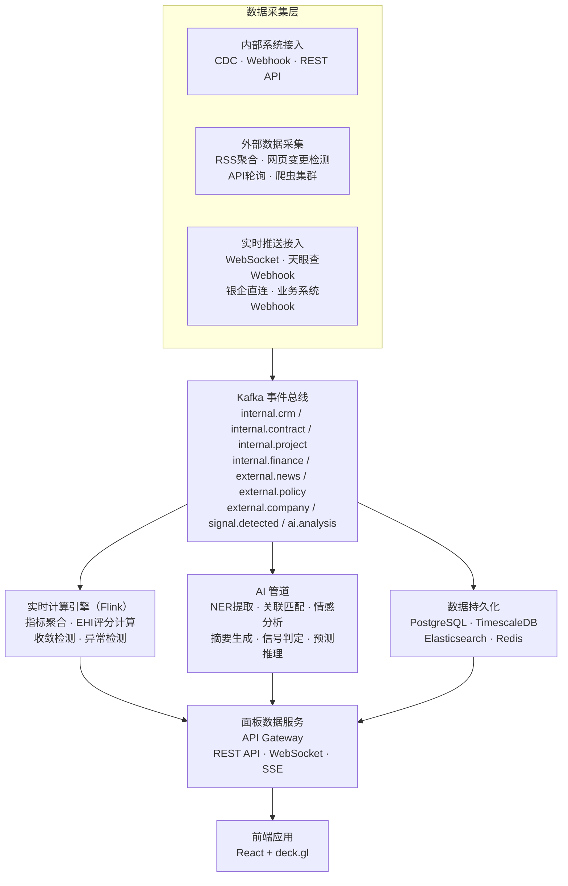

---

## 10. 权限、安全与合规

### 10.1 角色与数据可见性矩阵

| 角色 | EHI | 收入 | 客户 | 项目 | 人力 | 外部情报 | 资本市场 | AI 对话 |
|------|-----|------|------|------|------|---------|---------|---------|
| CEO/CFO/COO | 全部 | 全部（含利润率） | 全部 | 全部 | 全部（含薪酬聚合） | 全部 | 全部 | 全权限 |
| VP/总监 | 本事业部 | 本事业部 | 本事业部 | 本事业部 | 本部门 | 全部 | 全部 | 本事业部 |
| 部门经理 | 本部门+负责客户 | 负责客户 | 负责客户 | 负责项目 | 本部门（不含薪酬） | 相关行业 | 仅公开数据 | 本权限范围 |
| 销售 | 负责客户 | 负责客户 | 负责客户+商机 | 无 | 无 | 相关行业+竞对 | 仅公开数据 | 客户/商机 |
| PM | 项目关联客户 | 负责项目 | 项目关联 | 负责项目 | 项目组 | 项目所在地风险 | 无 | 项目查询 |
| 只读分析师 | 脱敏汇总 | 脱敏汇总 | 脱敏 | 脱敏 | 脱敏 | 全部 | 全部 | 脱敏查询 |

### 10.2 数据安全红线

| 规则 | 说明 |
|------|------|
| **AI 模型私有化** | 所有 LLM 推理在企业私有环境运行（Qwen/DeepSeek私有化），内部数据不出企业边界 |
| **AI 不存储对话** | AI 对话仅保留会话期间，不持久化（审计日志除外） |
| **薪酬数据隔离** | 薪酬个人明细仅 HR 管理员可见，EM 仅接收部门/项目级聚合值 |
| **客户数据脱敏** | 只读分析师角色看到的客户名称做脱敏处理 |
| **外部爬虫合规** | 外部数据采集严格遵守 robots.txt |
| **审计日志** | 所有数据查询（含 AI 对话）记录完整审计日志 |
| **ZTA 集成** | 与品高聆客的零信任接入（ZTA）打通 |

---

## 11. 技术架构

### 11.1 整体技术栈

| 层 | 技术选型 | 选型理由 |
|----|---------|---------|
| **前端框架** | React 19 + TypeScript | 组件化、类型安全、生态丰富 |
| **地图引擎** | deck.gl + MapLibre GL | WM 验证过的方案，WebGL 高性能 |
| **图表库** | ECharts 5 + TradingView lightweight-charts | 通用图表 + 时序趋势 |
| **Sparkline** | 自研 Canvas 组件 | 16px 高迷你图，极致性能 |
| **状态管理** | Zustand + TanStack Query | 轻量全局状态 + 服务端状态缓存 |
| **实时通信** | WebSocket + SSE | L1 双向推送 + L2 单向推送 |
| **离线缓存** | IndexedDB (Dexie.js) | 快照存储、面板状态持久化 |
| **后端框架** | Python FastAPI | 数据聚合、AI管道调度、高并发异步 |
| **消息总线** | Apache Kafka | 内外部事件统一总线 |
| **CDC** | Debezium (MySQL) / pgoutput (PG) | 数据库变更捕获，不侵入业务系统 |
| **实时计算** | Apache Flink | EHI 评分实时计算、收敛检测 |
| **AI 推理** | 私有化 Qwen-72B / DeepSeek-V3 (vLLM) | 企业数据不出边界 |
| **NER / 关联** | 私有化 NER 模型 + Neo4j | 外部文本实体抽取 + 内部实体关联 |
| **搜索引擎** | Elasticsearch 8 | 全局搜索、外部信息全文检索 |
| **时序数据库** | TimescaleDB | Sparkline 查询、时间轴回放 |
| **关系数据库** | PostgreSQL 16 | 领域对象存储、权限管理 |
| **缓存** | Redis 7 (Cluster) | EHI 实时评分缓存 |
| **任务调度** | Apache Airflow | 外部数据定时采集、L4 批处理 |
| **API 网关** | Kong / APISIX | 统一入口、限流、认证 |
| **部署** | K8s（私有化 / 信创云） | 政企合规要求 |
| **监控** | Prometheus + Grafana | 系统和数据管道监控 |
| **客户端** | 品高聆客 Electron Webview | 复用认证和 ZTA |

### 11.2 前端架构

```
EnterpriseMonitor 前端
├── src/
│   ├── app/                    # 应用入口、路由、主布局
│   ├── components/
│   │   ├── layout/             # 三栏布局、顶栏、面板容器
│   │   ├── panels/             # P01-P16 面板组件
│   │   ├── map/                # 地图引擎（deck.gl 图层）
│   │   ├── charts/             # 图表组件（ECharts、Sparkline）
│   │   ├── cards/              # 实体卡片（客户、项目、员工等）
│   │   ├── signals/            # 信号标签、收敛告警组件
│   │   └── ai/                 # AI 摘要展示、对话窗口
│   ├── hooks/
│   │   ├── useWebSocket.ts     # L1 实时推送
│   │   ├── useSSE.ts           # L2 事件流
│   │   └── useEHI.ts           # EHI 评分订阅
│   ├── stores/
│   │   ├── panelStore.ts       # 面板顺序、折叠状态
│   │   ├── filterStore.ts      # 时间轴、筛选条件
│   │   └── themeStore.ts       # 主题、密度级别
│   ├── services/
│   │   ├── api.ts              # REST API 客户端
│   │   ├── realtime.ts         # WebSocket / SSE 管理
│   │   └── search.ts           # 全局搜索服务
│   └── utils/
│       ├── colors.ts           # 五色系统
│       ├── formatters.ts       # 数字格式化
│       └── permissions.ts      # 前端权限过滤
```

### 11.3 后端微服务架构

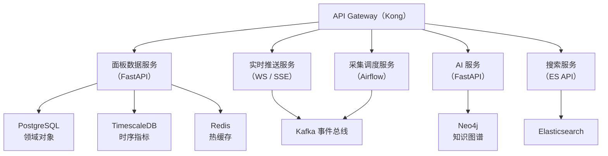

---

## 12. 实施路径与里程碑

### Phase 1：内部数据融合 MVP（3 个月）

**目标**：让管理层第一次在一块屏幕上看到企业经营全貌

| 交付物 | 说明 |
|--------|------|
| 核心面板 ×4 | P01（AI经营态势）、P02（EHI，不含外部维度O）、P03（收入脉搏）、P05（项目交付态势） |
| 数据接入 ×5 | CRM、合同、财务、协作、项目协管 |
| EHI 基础版 | CHI（R+E+D，不含O）、PHI（S+Q+C+T） |
| AI 摘要 | 日报级晨报（规则模板+LLM 润色） |
| 界面框架 | 左右两栏布局、顶部状态栏（四站切换）、面板管理、时间轴 |
| 无地图 | 中央区用网格看板替代，地图引擎延后 |

### Phase 2：外部情报打通（+3 个月，累计 6 个月）

**目标**：核心差异化——内外部信息融合到每个专题站

| 交付物 | 说明 |
|--------|------|
| 新增面板 ×5 | P04（客户风险雷达）、P07（情报流）、P11（政策监控）、**P13（资本市场）**、P12（竞争情报） |
| 外部数据源 ×7 | 政策RSS、政采平台、企业工商API、财经新闻RSS、招投标、宏观数据、**资本市场数据** |
| NER + 关联引擎 | 外部文本实体抽取，与内部客户/项目自动关联 |
| EHI 完整版 | CHI 增加 O（外部信号）维度 |
| AI 信号检测 | 16 种信号中的 8 种上线（S01-S05, S07, S14, S16） |
| AI 闪报 | CRITICAL 信号实时推送到品高聆客 IM |

### Phase 3：AI 深度智能化（+3 个月，累计 9 个月）

**目标**：AI 从「辅助」变为「驱动」

| 交付物 | 说明 |
|--------|------|
| 新增面板 ×3 | P06（商机漏斗）、P10（AI预测预报）、**P14（宏观经济）** |
| AI 预测引擎 | 月度收入预测、商机成单概率、项目按时交付概率 |
| AI 收敛检测 | 业务实体多信号收敛自动检测 |
| AI 对话入口 | 自然语言查询 |
| 剩余信号 | 16 种信号全部上线 |
| 快照 Diff | 任意两个时间点的状态对比 + AI 摘要 |

### Phase 4：全功能上线（+3 个月，累计 12 个月）

**目标**：对标 WorldMonitor 的完整度

| 交付物 | 说明 |
|--------|------|
| 新增面板 ×4 | P08（人力资源）、P09（依赖分析）、**P15（人才市场）**、**P16（供应商生态）** |
| 地图引擎 | deck.gl + MapLibre GL，8 个图层 |
| 级联分析引擎 | 企业依赖关系图谱，级联影响模拟 |
| 数据接入补全 | 工作量、考勤、绩效、招聘、IM元数据等 P1/P2 系统 |
| 外部数据源补全 | 竞对监控、社交媒体、上市客户财报、**人才市场**等 |
| 个性化视图 | 按角色（CEO/VP/PM/销售）定制默认面板组 |
| MCP 集成 | 暴露 MCP 协议接口，允许 LinkClaw 和其他 AI 调用 EM 数据 |

---

## 13. 附录：WorldMonitor 功能完整映射表

| # | WorldMonitor 功能 | EnterpriseMonitor 对应 | 阶段 | 差异 |
|---|------------------|----------------------|------|------|
| 1 | 五大专题站 | **四大专题站**（经营/交付/财务/人力），外部信息融入各站 | P1 | 取消独立外部站 |
| 2 | DEFCON 综合警报 | EHI 企业健康指数 + ALERT 徽章 | P1 | 从全球紧张度到企业健康度 |
| 3 | CII 国家不稳定指数 | EHI/CHI/PHI/DHI（多实体多维） | P1-P2 | 从国家评估到多层实体评估 |
| 4 | 49 个地图图层 | 8 个企业图层 | P4 | 精简但聚焦 |
| 5 | 2D/3D 地图切换 | 2D 地图 / 网格看板切换 | P1/P4 | 3D 非必需 |
| 6 | 右侧面板栏（8980px） | **16 个面板**（可滚动/可排序） | P1-P4 | 企业化面板 |
| 7 | 实时新闻面板（344 RSS） | 外部情报流（50+ RSS + API） | P2 | 增加内部对象关联 |
| 8 | AI 摘要四级调用链 | AI 摘要三级调用链（私有LLM→LinkClaw→规则引擎） | P1 | 安全优先 |
| 9 | 12 种信号类型 | 16 种企业信号类型 | P2-P3 | 企业场景扩展 |
| 10 | 地理收敛检测 | 业务实体收敛检测 | P3 | 从空间到业务维度 |
| 11 | 基础设施级联分析 | 企业依赖链级联分析 | P4 | 从物理基设到业务依赖 |
| 12 | AI Forecasts | AI 业务预测预报 | P3 | 企业场景预测 |
| 13 | Cmd+K 全局搜索 | ⌘K 全局搜索 + NL查询 | P1/P3 | 增加 AI 对话 |
| 14 | 时间轴筛选器 | 时间轴 + 快照Diff | P1/P3 | 增加企业节奏时间 |
| 15 | 面板拖拽排序 | 完全继承 | P1 | 一致 |
| 16 | 状态持久化 | 完全继承 | P1 | 一致 |
| 17 | 分享链接 | 完全继承 + 权限校验 | P1 | 增加权限 |
| 18 | 多语言（21种） | 中文为主，英文备选 | P4 | 精简 |
| 19 | 暗/亮主题 | 完全继承 | P1 | 一致 |
| 20 | Tauri 桌面端 | 品高聆客 Electron | P1 | 复用现有 |
| 21 | Pro/Enterprise 分级 | 角色权限分级 | P1 | 按角色 |
| 22 | MCP 集成 | MCP 接口暴露 | P4 | 允许外部AI调用 |
| 23 | 幽灵船检测 | 商机/合同异常检测 | P2 | 行为异常检测 |
| 24 | 升级监视器 | EHI 快速下降监视 | P2 | 健康度变化告警 |
| 25 | 直播摄像头 | 不需要 | - | — |
| 26 | 435 数据源 | 27内部 + 16类外部源 | P1-P4 | 数量少但深度集成 |
| 27 | 数据导出 | 数据导出 + 报表生成 | P2 | 增加结构化报表 |
| 28 | AI 晨报 | AI 晨报/周报/闪报/会议简报 | P1/P2 | 增加周报和会议简报 |
| 29 | 金融市场面板 | **资本市场面板（P13）** | P2 | 企业自身+同业 |
| 30 | — | **宏观经济面板（P14）** | P3 | WM无对应，EM新增 |
| 31 | — | **人才市场面板（P15）** | P4 | WM无对应，EM新增 |
| 32 | — | **供应商生态面板（P16）** | P4 | WM无对应，EM新增 |

---

*本说明书基于 WorldMonitor v2.6.7 功能架构说明书与品高聆客 v5.2.9 功能架构说明书，从内外信息打通、实时性、信息密度、AI参与度四个维度进行深度需求设计。v1.1 核心变更：取消独立「外部站」，将外部信息融入四大专题站；新增资本市场、宏观经济、人才市场、供应商生态四个面板。由 Claude Opus 4.6 撰写（v1.1，2026-04-10）。*
